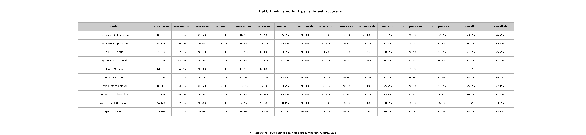

# HuLU Per-Sub-Task Bontás

*Generálva:* 2026-06-15T08:21:30.791331+00:00

*19 benchmark (egyedi rekord: utolsó előfordulás alapján).*

## Módszer

A `results/{model}-{mode}/hulu_results.jsonl` fájlokból csoportosítunk a `task` mező szerint. Duplikátumok (RESUME-ból): az utolsó előfordulás számít. A sub-task accuracy egyszerű átlag (`correct / total`); a HuCOLA-t is így kezeljük (a kanonikus specifikáció MCC-t ír elő, de a JSONL `correct: bool` mezőt tartalmaz, így a kompatibilitás kedvéért itt is accuracy-t jelentetünk).

- **Composite** (per spec): a 6 sub-task accuracy egyszerű (egyenként súlyozatlan) átlaga — megfelel a `wiki/concepts/hulu-benchmark.md` Aggregáció szekciójának.
- **Overall** (kanonikus): az összes promptra számított accuracy (`total_correct / total_examples`) — ez a `hulu_summary.json` `accuracy` mezője, és a kanonikus `aggregate_results.py` HuLU score-ja. A HuSST (1165 prompt) dominálja, így a nehezebb HuSST-s modellek alacsonyabb overall score-t kapnak.

## Táblázat — think vs nothink (accuracy %, külön oszlopok)

| Modell | HuCOLA nt | HuCoPA nt | HuRTE nt | HuSST nt | HuWNLI nt | HuCB nt | HuCOLA th | HuCoPA th | HuRTE th | HuSST th | HuWNLI th | HuCB th | Composite nt | Composite th | Overall nt | Overall th |
|---|---|---|---|---|---|---|---|---|---|---|---|---|---|---|---|---|
| **deepseek-v4-flash-cloud** | 88.1% | 91.0% | 81.5% | 62.0% | 46.7% | 50.5% | 85.9% | 93.0% | 95.1% | 67.8% | 25.0% | 67.0% | 70.0% | 72.3% | 73.3% | 76.7% |
| **deepseek-v4-pro-cloud** | 85.4% | 86.0% | 58.0% | 72.5% | 28.3% | 57.3% | 85.9% | 96.0% | 91.8% | 66.2% | 21.7% | 71.8% | 64.6% | 72.2% | 74.6% | 75.9% |
| **glm-5.1-cloud** | 75.1% | 97.0% | 90.1% | 65.5% | 31.7% | 65.0% | 83.3% | 95.0% | 94.2% | 67.5% | 6.7% | 80.6% | 70.7% | 71.2% | 71.6% | 75.7% |
| **gpt-oss-120b-cloud** | 72.7% | 92.0% | 90.5% | 66.7% | 41.7% | 74.8% | 71.5% | 90.0% | 91.4% | 66.6% | 55.0% | 74.8% | 73.1% | 74.9% | 71.8% | 71.6% |
| **gpt-oss-20b-cloud** | 61.1% | 84.0% | 93.0% | 65.9% | 41.7% | 68.0% | — | — | — | — | — | — | 68.9% | — | 67.0% | — |
| **kimi-k2.6-cloud** | 79.7% | 91.0% | 89.7% | 70.0% | 55.0% | 75.7% | 78.7% | 97.0% | 94.7% | 69.4% | 11.7% | 81.6% | 76.8% | 72.2% | 75.9% | 75.2% |
| **minimax-m3-cloud** | 83.3% | 98.0% | 81.5% | 69.9% | 13.3% | 77.7% | 83.7% | 96.0% | 88.5% | 70.3% | 35.0% | 75.7% | 70.6% | 74.9% | 75.8% | 77.1% |
| **nemotron-3-ultra-cloud** | 72.4% | 89.0% | 86.8% | 65.7% | 41.7% | 68.9% | 75.3% | 93.0% | 91.8% | 65.8% | 11.7% | 75.7% | 70.8% | 68.9% | 70.5% | 71.8% |
| **qwen3-next-80b-cloud** | 57.6% | 92.0% | 93.8% | 58.5% | 5.0% | 56.3% | 58.1% | 91.0% | 93.0% | 60.5% | 35.0% | 58.3% | 60.5% | 66.0% | 61.4% | 63.2% |
| **qwen3.5-cloud** | 81.6% | 97.0% | 78.6% | 70.0% | 26.7% | 71.8% | 87.6% | 96.0% | 94.2% | 69.6% | 1.7% | 80.6% | 71.0% | 71.6% | 75.0% | 78.1% |

## Táblázat — per sub-task (accuracy %)

| Modell (mód) | HuCOLA | HuCoPA | HuRTE | HuSST | HuWNLI | HuCB | Composite | Overall |
|---|---|---|---|---|---|---|---|---|
| **kimi-k2.6-cloud (nothink)** | 79.7% (n=910) | 91.0% (n=100) | 89.7% (n=243) | 70.0% (n=1165) | 55.0% (n=60) | 75.7% (n=103) | **76.8%** | 75.9% |
| **gpt-oss-120b-cloud (think)** | 71.5% (n=910) | 90.0% (n=100) | 91.4% (n=243) | 66.6% (n=1165) | 55.0% (n=60) | 74.8% (n=103) | **74.9%** | 71.6% |
| **minimax-m3-cloud (think)** | 83.7% (n=910) | 96.0% (n=100) | 88.5% (n=243) | 70.3% (n=1165) | 35.0% (n=60) | 75.7% (n=103) | **74.9%** | 77.1% |
| **gpt-oss-120b-cloud (nothink)** | 72.7% (n=910) | 92.0% (n=100) | 90.5% (n=243) | 66.7% (n=1165) | 41.7% (n=60) | 74.8% (n=103) | **73.1%** | 71.8% |
| **deepseek-v4-flash-cloud (think)** | 85.9% (n=910) | 93.0% (n=100) | 95.1% (n=243) | 67.8% (n=1165) | 25.0% (n=60) | 67.0% (n=103) | **72.3%** | 76.7% |
| **deepseek-v4-pro-cloud (think)** | 85.9% (n=910) | 96.0% (n=100) | 91.8% (n=243) | 66.2% (n=1165) | 21.7% (n=60) | 71.8% (n=103) | **72.2%** | 75.9% |
| **kimi-k2.6-cloud (think)** | 78.7% (n=910) | 97.0% (n=100) | 94.7% (n=243) | 69.4% (n=1165) | 11.7% (n=60) | 81.6% (n=103) | **72.2%** | 75.2% |
| **qwen3.5-cloud (think)** | 87.6% (n=910) | 96.0% (n=100) | 94.2% (n=243) | 69.6% (n=1165) | 1.7% (n=60) | 80.6% (n=103) | **71.6%** | 78.1% |
| **glm-5.1-cloud (think)** | 83.3% (n=910) | 95.0% (n=100) | 94.2% (n=243) | 67.5% (n=1165) | 6.7% (n=60) | 80.6% (n=103) | **71.2%** | 75.7% |
| **qwen3.5-cloud (nothink)** | 81.6% (n=910) | 97.0% (n=100) | 78.6% (n=243) | 70.0% (n=1165) | 26.7% (n=60) | 71.8% (n=103) | **71.0%** | 75.0% |
| **nemotron-3-ultra-cloud (nothink)** | 72.4% (n=910) | 89.0% (n=100) | 86.8% (n=243) | 65.7% (n=1165) | 41.7% (n=60) | 68.9% (n=103) | **70.8%** | 70.5% |
| **glm-5.1-cloud (nothink)** | 75.1% (n=910) | 97.0% (n=100) | 90.1% (n=243) | 65.5% (n=1165) | 31.7% (n=60) | 65.0% (n=103) | **70.7%** | 71.6% |
| **minimax-m3-cloud (nothink)** | 83.3% (n=910) | 98.0% (n=100) | 81.5% (n=243) | 69.9% (n=1165) | 13.3% (n=60) | 77.7% (n=103) | **70.6%** | 75.8% |
| **deepseek-v4-flash-cloud (nothink)** | 88.1% (n=910) | 91.0% (n=100) | 81.5% (n=243) | 62.0% (n=1165) | 46.7% (n=60) | 50.5% (n=103) | **70.0%** | 73.3% |
| **gpt-oss-20b-cloud (nothink)** | 61.1% (n=910) | 84.0% (n=100) | 93.0% (n=243) | 65.9% (n=1165) | 41.7% (n=60) | 68.0% (n=103) | **68.9%** | 67.0% |
| **nemotron-3-ultra-cloud (think)** | 75.3% (n=910) | 93.0% (n=100) | 91.8% (n=243) | 65.8% (n=1165) | 11.7% (n=60) | 75.7% (n=103) | **68.9%** | 71.8% |
| **qwen3-next-80b-cloud (think)** | 58.1% (n=910) | 91.0% (n=100) | 93.0% (n=243) | 60.5% (n=1165) | 35.0% (n=60) | 58.3% (n=103) | **66.0%** | 63.2% |
| **deepseek-v4-pro-cloud (nothink)** | 85.4% (n=910) | 86.0% (n=100) | 58.0% (n=243) | 72.5% (n=1165) | 28.3% (n=60) | 57.3% (n=103) | **64.6%** | 74.6% |
| **qwen3-next-80b-cloud (nothink)** | 57.6% (n=910) | 92.0% (n=100) | 93.8% (n=243) | 58.5% (n=1165) | 5.0% (n=60) | 56.3% (n=103) | **60.5%** | 61.4% |

## Táblázat — sec/pr (másodperc / prompt, átlag)

> *Megjegyzés: a `hulu_breakdown_sec_pr.png` a v1.2.9-ben törölve lett (sebesség nem mérendő a riportban). A táblázat megmaradt történeti adatként.*

| Modell (mód) | HuCOLA | HuCoPA | HuRTE | HuSST | HuWNLI | HuCB |
|---|---|---|---|---|---|---|
| **kimi-k2.6-cloud (nothink)** | 0.77s | 0.82s | 0.81s | 0.81s | 0.85s | 0.69s |
| **gpt-oss-120b-cloud (think)** | 3.91s | 2.66s | 2.65s | 2.20s | 5.35s | 4.22s |
| **minimax-m3-cloud (think)** | 8.99s | 4.79s | 11.69s | 3.53s | 27.29s | 7.42s |
| **gpt-oss-120b-cloud (nothink)** | 5.10s | 3.58s | 3.90s | 2.58s | 8.12s | 5.80s |
| **deepseek-v4-flash-cloud (think)** | 4.26s | 3.33s | 6.75s | 1.75s | 27.22s | 4.12s |
| **deepseek-v4-pro-cloud (think)** | 7.28s | 7.04s | 17.30s | 2.23s | 11.87s | 4.62s |
| **kimi-k2.6-cloud (think)** | 20.33s | 5.82s | 19.74s | 3.70s | 32.53s | 15.12s |
| **qwen3.5-cloud (think)** | 22.79s | 17.88s | 45.91s | 16.90s | 41.43s | 35.47s |
| **glm-5.1-cloud (think)** | 4.89s | 3.30s | 7.12s | 2.91s | 8.53s | 4.75s |
| **qwen3.5-cloud (nothink)** | 1.04s | 1.11s | 1.67s | 0.99s | 2.59s | 1.53s |
| **nemotron-3-ultra-cloud (nothink)** | 2.89s | 3.82s | 3.04s | 2.69s | 5.10s | 3.45s |
| **glm-5.1-cloud (nothink)** | 1.37s | 1.06s | 1.08s | 1.29s | 1.35s | 1.24s |
| **minimax-m3-cloud (nothink)** | 11.11s | 6.31s | 12.05s | 3.89s | 20.13s | 8.14s |
| **deepseek-v4-flash-cloud (nothink)** | 0.93s | 1.09s | 0.85s | 0.94s | 0.98s | 1.07s |
| **gpt-oss-20b-cloud (nothink)** | — | — | — | — | — | — |
| **nemotron-3-ultra-cloud (think)** | 33.46s | 25.78s | 65.62s | 17.61s | 54.86s | 38.91s |
| **qwen3-next-80b-cloud (think)** | 12.32s | 6.20s | 19.21s | 14.32s | 50.81s | 28.57s |
| **deepseek-v4-pro-cloud (nothink)** | 0.58s | 0.55s | 0.67s | 0.59s | 0.62s | 0.54s |
| **qwen3-next-80b-cloud (nothink)** | 11.95s | 6.13s | 19.67s | 8.44s | 28.87s | 18.74s |

## Táblázat — TS/pr (token/sec / prompt, becsült)

> *Megjegyzés: a `hulu_breakdown_ts_pr.png` a v1.2.9-ben törölve lett (sebesség nem mérendő). A táblázat megmaradt történeti adatként.*

| Modell (mód) | HuCOLA | HuCoPA | HuRTE | HuSST | HuWNLI | HuCB |
|---|---|---|---|---|---|---|
| **kimi-k2.6-cloud (nothink)** | 3 | 2 | 4 | 2 | 7 | 3 |
| **gpt-oss-120b-cloud (think)** | 74 | 80 | 80 | 69 | 81 | 76 |
| **minimax-m3-cloud (think)** | 36 | 29 | 40 | 20 | 47 | 35 |
| **gpt-oss-120b-cloud (nothink)** | 70 | 71 | 69 | 65 | 74 | 66 |
| **deepseek-v4-flash-cloud (think)** | 77 | 92 | 94 | 58 | 108 | 93 |
| **deepseek-v4-pro-cloud (think)** | 56 | 61 | 54 | 107 | 187 | 148 |
| **kimi-k2.6-cloud (think)** | 130 | 154 | 171 | 120 | 147 | 135 |
| **qwen3.5-cloud (think)** | 51 | 49 | 57 | 64 | 80 | 72 |
| **glm-5.1-cloud (think)** | 138 | 137 | 160 | 147 | 139 | 164 |
| **qwen3.5-cloud (nothink)** | 6 | 10 | 24 | 6 | 11 | 4 |
| **nemotron-3-ultra-cloud (nothink)** | 1 | 1 | 1 | 1 | 0 | 1 |
| **glm-5.1-cloud (nothink)** | 1 | 1 | 1 | 1 | 1 | 1 |
| **minimax-m3-cloud (nothink)** | 27 | 21 | 33 | 18 | 45 | 36 |
| **deepseek-v4-flash-cloud (nothink)** | 1 | 1 | 1 | 1 | 1 | 1 |
| **gpt-oss-20b-cloud (nothink)** | — | — | — | — | — | — |
| **nemotron-3-ultra-cloud (think)** | 11 | 9 | 14 | 11 | 15 | 12 |
| **qwen3-next-80b-cloud (think)** | 191 | 175 | 202 | 136 | 181 | 145 |
| **deepseek-v4-pro-cloud (nothink)** | 3 | 4 | 3 | 3 | 3 | 4 |
| **qwen3-next-80b-cloud (nothink)** | 193 | 177 | 204 | 131 | 138 | 134 |

## Összesítés — sub-task nehézség (minden modell átlaga)

> *Megjegyzés: a `hulu_breakdown_difficulty.png` a v1.2.10-ben törölve lett (a felhasználó nem kérte a pool-szintű összesítést). A táblázat megmaradt történeti adatként.*

Melyik sub-task a legnehezebb / legkönnyebb a teljes modell-poolra:

| Sub-task | n (összes) | Pool átlag acc | Legjobb modell acc |
|---|---|---|---|
| **HuCOLA** | 910 | 77.2% | 88.1% (deepseek-v4-flash-cloud (nothink)) |
| **HuCoPA** | 100 | 92.8% | 98.0% (minimax-m3-cloud (nothink)) |
| **HuRTE** | 243 | 88.3% | 95.1% (deepseek-v4-flash-cloud (think)) |
| **HuSST** | 1165 | 66.9% | 72.5% (deepseek-v4-pro-cloud (nothink)) |
| **HuWNLI** | 60 | 28.2% | 55.0% (kimi-k2.6-cloud (nothink)) |
| **HuCB** | 103 | 70.1% | 81.6% (kimi-k2.6-cloud (think)) |