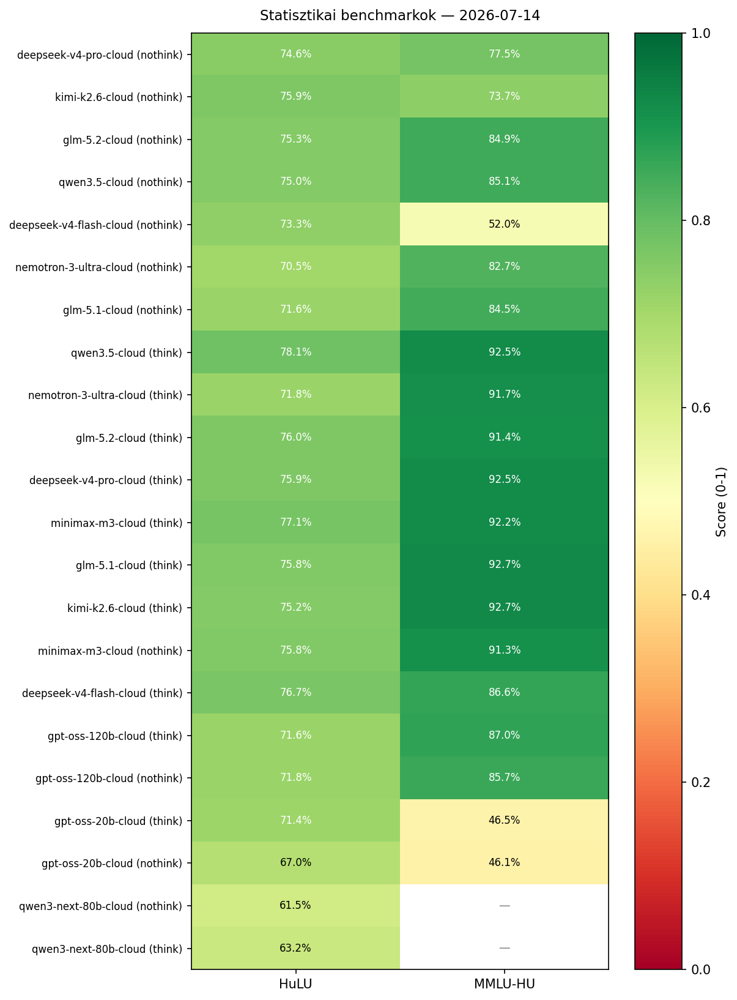
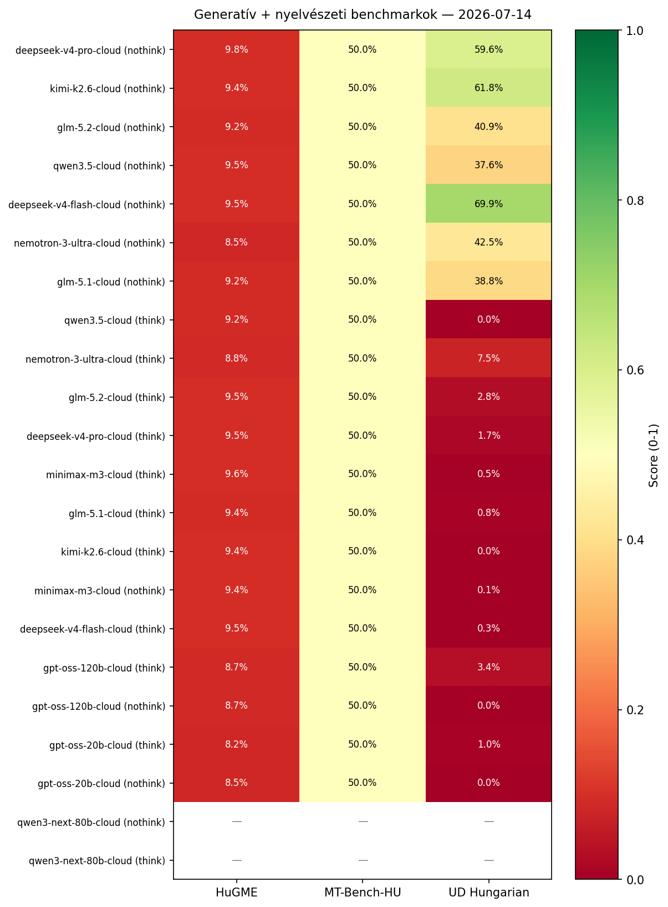

# Végleges Riport — 2026-07-14. 20:14 CEST (queue kész)

*Típus:* report
*Forrás(ok):* belső projekt futtatás, `priority_judge.sh` 2026-07-13→2026-07-14
*Létrehozva:* 2026-07-15
*Frissítve:* 2026-07-28

---

## Fejléc

| Mező | Érték |
|---|---|
| Riport azonosító | `hu-eval-20260714-11modell` |
| Riport dátum | 2026-07-14 |
| Értékelt modellek | 10 aktív cloud + qwen3-next-80b-cloud RETIRED + 1 lokális (Qwen3-Next-80B IQ3_XXS) |
| Operator | fater.zsolt |
| Riport státusz | **final — BASELINE** |
| Bíró modell | `deepseek-v4-pro:cloud` (a `gemini-3-flash-preview:latest` 2026-07-14. 09:00 CEST óta nem elérhető, helyette ez a hivatalos bíró) |

### Modell-kvantálás

_A jelenlegi modellek Ollama Cloud alatt futottak, így a pontos lokális kvantálási szint nem ismert — a forrást `ollama-cloud`-ként tüntetjük fel. Új modell esetén a kvantálást mindig rá kell kérdezni és a riportban szerepeltetni kell (lásd konvenció)._

| Modell | Kvantálás |
|---|---|
| deepseek-v4-flash-cloud | ollama-cloud |
| deepseek-v4-pro-cloud | ollama-cloud |
| glm-5.1-cloud | ollama-cloud |
| glm-5.2-cloud | ollama-cloud |
| gpt-oss-120b-cloud | ollama-cloud |
| gpt-oss-20b-cloud | ollama-cloud |
| kimi-k2.6-cloud | ollama-cloud |
| minimax-m3-cloud | ollama-cloud |
| nemotron-3-ultra-cloud | ollama-cloud |
| qwen3.5-cloud | ollama-cloud |
| **qwen3-next-80b-cloud** | ollama-cloud (RETIRED) |
| Qwen3-Next-80B IQ3_XXS (lok.) | IQ3_XXS ≈3.06 bpw (llama-server, 128K ctx) |

> 🎯 **BASELINE (alapérték):** Ez a riport a projekt **hivatalos kiindulási alapértéke** minden jövőbeli benchmark-összehasonlításhoz. A benne szereplő 40/40/20 kompozit score-ok és per-benchmark értékek referenciaként szolgálnak a későbbi modell- vagy bíróváltások utáni re-futtatások kiértékeléséhez. Új futtatás esetén az eltérést ehhez a riporthoz képest kell mérni.

> **Bíró modell** (LLM-as-a-Judge): `deepseek-v4-pro:cloud` — a `gemini-3-flash-preview:latest` 2026-07-14. 09:00 CEST óta nem elérhető (Ollama megszűnés), helyette ez a hivatalos bíró. A HuGME és MT-Bench-HU eredményeket ezzel a bíróval kell újrapontoszni. **Self-bias korlát (SZENT):** a bíró modell nem értékelheti saját magát — a `deepseek-v4-pro` saját HuGME/MT-Bench sorai független bíróval vagy kivételzéssel kezelendők.

### Időkeret

- **Mérés indítása:** 2026-07-08 (a legrégebbi state timestamp)
- **Mérés befejezése:** 2026-07-14. 20:14 CEST
- **Teljes futásidő:** ~1029 ó processzoridő (a párhuzamos futás miatt a valós idő rövidebb)

## Executive Summary

A **legegyensúlyozottabb modell** a **40/40/20 kompozit score** alapján a **deepseek-v4-pro-cloud (nothink)** (54.3%), amely a 4 fő benchmarkon (HuLU, MMLU-HU, HuGME, UD) átlagosan 55.4%-os teljesítményt ér el.
A 2-3. helyen a **kimi-k2.6-cloud (nothink)** és a **glm-5.2-cloud (nothink)** áll, mindkettő ~52-55%-os kompozit score-ral.

**Lokális modell (új):** a **Qwen3-Next-80B IQ3_XXS (lokális, think)** 64.85%-os kompozit score-t ért el, de a HuGME/MT-Bench-HU eredmények eltérő skálájúak (0–100% vs. 0–10%), így a cloud modellekkel **nem közvetlenül összehasonlítható**. A statisztikai (71.70%) és nyelvészeti (64.73%) dimenziók viszont közvetlenül összehasonlíthatóak — az UD Hungarian-nál a think modellek között a legjobb (64.73% vs. 0–7.5% cloud think).

**Fő tradeoff:** a **nothink** modellek jobban teljesítenek a nyelvészeti benchmarkokon (UD Hungarian, ahol a CoT-zavar rontja a parsolást), míg a **think** modellek a statisztikai benchmarkokon (MMLU-HU-n átlagosan +25%).

**Ajánlás:** statisztikai feladatokra (pl. MMLU-HU) **think mód**, nyelvészeti/UD feladatokra **nothink mód** használata javasolt. A HuLU-n a modellek 71-78%-os szűk sávban mozognak, így a választás inkább a sebesség/költség alapján történjen (ha lesz ilyen adat).

### Főbb számok egy sorban

- 🥇 **Legjobb HuLU:** qwen3.5-cloud (think) — 78.1%
- 🥇 **Legjobb MMLU-HU:** kimi-k2.6-cloud (think) — 92.7%
- 🥇 **Legjobb HuGME (judge score):** deepseek-v4-pro-cloud (nothink) — 9.8% (cloud skála); Qwen3-Next-80B IQ3_XXS (lok.) — 82.83% (eltérő skála, lásd lábjegyzet)
- 🥇 **Legjobb UD Hungarian:** deepseek-v4-flash-cloud (nothink) — 69.9%; lokális think: Qwen3-Next-80B IQ3_XXS — 64.73%
- 🏆 **Legjobb composite score (40/40/20):** deepseek-v4-pro-cloud (nothink) — 54.3%
- ⚠️ **Legnagyobb meglepetés:** gpt-oss:20b think MMLU-HU 46.5% (a többi modell 73-92%)

## Per-benchmark eredmények

### HuLU eredmények

_(stat — 6 NLU sub-task: HuCOLA, HuCoPA, HuRTE, HuSST, HuWNLI, HuCB)_

**Mit tesztel:** a magyar nyelvű természetes nyelvmegértést (NLU) méri 6 al-benchmarkon: **HuCOLA** (nyelvtani elfogadhatóság eldöntése), **HuCoPA** (közös előfordulás / ok-okozat pár választás), **HuRTE** (szöveg-entailment, háromirányú következtetés), **HuSST** (szentimentelemzés, 5 osztály), **HuWNLI** (WordNet-alapú lexicalis következtetés, a legnehezebb), **HuCB** (CommitmentBank — beszédaktus/elköteleződés osztályozás). Kimenet: egyesített accuracy + per-sub-task bontás.

| Modell | Mód | Eredmény |
|---|---|---|
| deepseek-v4-flash-cloud | nothink | 73.3% |
| deepseek-v4-flash-cloud | think | 76.7% |
| deepseek-v4-pro-cloud | nothink | 74.6% |
| deepseek-v4-pro-cloud | think | 75.9% |
| glm-5.1-cloud | nothink | 71.6% |
| glm-5.1-cloud | think | 75.8% |
| glm-5.2-cloud | nothink | 76.6% (2026-07-18 újramérve) |
| glm-5.2-cloud | think | 75.5% (2026-07-18 újramérve) |
| gpt-oss-120b-cloud | nothink | 71.8% |
| gpt-oss-120b-cloud | think | 71.6% |
| gpt-oss-20b-cloud | nothink | 67.0% |
| gpt-oss-20b-cloud | think | 71.5% (2026-07-18 újramérve) |
| kimi-k2.6-cloud | nothink | 75.9% |
| kimi-k2.6-cloud | think | 75.2% |
| minimax-m3-cloud | nothink | 75.8% |
| minimax-m3-cloud | think | 77.1% |
| nemotron-3-ultra-cloud | nothink | 70.5% |
| nemotron-3-ultra-cloud | think | 71.8% |
| qwen3.5-cloud | nothink | 75.0% |
| qwen3.5-cloud | think | 78.1% |
| **qwen3-next-80b-cloud** | nothink | 61.5% |
| **qwen3-next-80b-cloud** | think | 63.2% |
| Qwen3-Next-80B IQ3_XXS (lok.) | think | 56.53% |

**Legjobb:** qwen3.5-cloud (think) — 78.1%
**Legrosszabb aktív (cloud):** gpt-oss-20b-cloud (nothink) — 67.0%
**Legrosszabb aktív (lokális):** Qwen3-Next-80B IQ3_XXS (think) — 56.53%

#### HuLU per-sub-task bontás (HuCOLA, HuCoPA, HuRTE, HuSST, HuWNLI, HuCB)

_Az egyesített HuLU score mellett az egyes al-benchmarkok (n=910 / 100 / 243 / 1165 / 60 / 103) accuracy értékei külön-külön. Forrás: `wiki/reports/hulu-breakdown-2026-06-16.md` (legfrissebb per-sub-task aggregáció). A `composite` oszlop a 6 sub-task súlyozatlan átlaga (ez a HuLU overall-tól eltérhet a HuSST dominanciája miatt)._

| Modell (mód) | HuCOLA | HuCoPA | HuRTE | HuSST | HuWNLI | HuCB | Composite |
|---|---|---|---|---|---|---|---|
| **kimi-k2.6-cloud (nothink)** | 79.7% | 91.0% | 89.7% | 70.0% | 55.0% | 75.7% | **76.8%** |
| **gpt-oss-120b-cloud (think)** | 71.5% | 90.0% | 91.4% | 66.6% | 55.0% | 74.8% | **74.9%** |
| **minimax-m3-cloud (think)** | 83.7% | 96.0% | 88.5% | 70.3% | 35.0% | 75.7% | **74.9%** |
| **gpt-oss-120b-cloud (nothink)** | 72.7% | 92.0% | 90.5% | 66.7% | 41.7% | 74.8% | **73.1%** |
| **deepseek-v4-flash-cloud (think)** | 85.9% | 93.0% | 95.1% | 67.8% | 25.0% | 67.0% | **72.3%** |
| **deepseek-v4-pro-cloud (think)** | 85.9% | 96.0% | 91.8% | 66.2% | 21.7% | 71.8% | **72.2%** |
| **kimi-k2.6-cloud (think)** | 78.7% | 97.0% | 94.7% | 69.4% | 11.7% | 81.6% | **72.2%** |
| **qwen3.5-cloud (think)** | 87.6% | 96.0% | 94.2% | 69.6% | 1.7% | 80.6% | **71.6%** |
| **glm-5.2-cloud (think)** | 81.1% | 95.0% | 95.1% | 68.2% | 6.7% | 84.5% | **75.5%** |
| **glm-5.1-cloud (think)** | 83.3% | 95.0% | 94.2% | 67.5% | 6.7% | 80.6% | **71.2%** |
| **qwen3.5-cloud (nothink)** | 81.6% | 97.0% | 78.6% | 70.0% | 26.7% | 71.8% | **71.0%** |
| **glm-5.2-cloud (nothink)** | 79.6% | 92.0% | 90.1% | 72.8% | 31.7% | 72.8% | **76.6%** |
| **nemotron-3-ultra-cloud (nothink)** | 72.4% | 89.0% | 86.8% | 65.7% | 41.7% | 68.9% | **70.8%** |
| **glm-5.1-cloud (nothink)** | 75.1% | 97.0% | 90.1% | 65.5% | 31.7% | 65.0% | **70.7%** |
| **minimax-m3-cloud (nothink)** | 83.3% | 98.0% | 81.5% | 69.9% | 13.3% | 77.7% | **70.6%** |
| **deepseek-v4-flash-cloud (nothink)** | 88.1% | 91.0% | 81.5% | 62.0% | 46.7% | 50.5% | **70.0%** |
| **gpt-oss-20b-cloud (nothink)** | 61.1% | 84.0% | 93.0% | 65.9% | 41.7% | 68.0% | **68.9%** |
| **gpt-oss-20b-cloud (think)** | 73.6% | 89.0% | 91.8% | 65.6% | 48.3% | 68.9% | **71.5%** |
| **nemotron-3-ultra-cloud (think)** | 75.3% | 93.0% | 91.8% | 65.8% | 11.7% | 75.7% | **68.9%** |
| **qwen3-next-80b-cloud (think)** | 58.1% | 91.0% | 93.0% | 60.5% | 35.0% | 58.3% | **66.0%** |
| **deepseek-v4-pro-cloud (nothink)** | 85.4% | 86.0% | 58.0% | 72.5% | 28.3% | 57.3% | **64.6%** |
| **qwen3-next-80b-cloud (nothink)** | 57.6% | 92.0% | 93.8% | 58.5% | 5.0% | 56.3% | **60.5%** |
| **Qwen3-Next-80B IQ3_XXS (lok., think)** | 51.54% | 90.00% | 72.84% | 57.00% | 13.33% | 49.51% | **55.70%** |

> **glm-5.2-cloud (nothink/overall 76.6%, think/overall 75.5%):** a per-sub-task bontás 2026-07-18-án készült el (korábban csak az overall szerepelt). HuWNLI a legnehezebb al-benchmark (nothink 31.7%, think 6.7% — a think mód CoT-zavara itt is jelentkezik, mint a többi modellnél).

**Sub-task szintű megfigyelések:**
- **HuWNLI** a legnehezebb al-benchmark (pool átlag ~28%), a legtöbb modell 1.7–55% között szóródik — különösen a think mód rontja (CoT-zavar).
- **HuSST** (n=1165) dominálja az overall score-t; a magas composite, de alacsony overall modellek (pl. deepseek-v4-pro-nothink: composite 64.6% vs overall 74.6%) gyenge HuSST-teljesítményt jeleznek.
- **glm-5.1/glm-5.2 nothink vs think:** a think mód emeli a HuCOLA/HuRTE/HuSST-t, de lenullázza a HuWNLI-t (pl. qwen3.5-think HuWNLI 1.7%).

### MMLU-HU eredmények

_(stat — 38 tantárgy, 5 kevés lövés / subject)_

**Mit tesztel:** a többválasztós, tantárgy-specifikus tudást (masszív multilingual tudásvizsga magyarul) 38 tantárgyban (pl. matek, történelem, jog, orvostudomány). 5-shot (5 példa a promptban) felállításban méri a modell általános tudását és rezoningjét; kimenet: tantárgyak átlagolt accuracy-ja (0-1).

| Modell | Mód | Eredmény |
|---|---|---|
| deepseek-v4-flash-cloud | nothink | 52.0% |
| deepseek-v4-flash-cloud | think | 86.6% |
| deepseek-v4-pro-cloud | nothink | 77.5% |
| deepseek-v4-pro-cloud | think | 92.5% |
| glm-5.1-cloud | nothink | 84.5% |
| glm-5.1-cloud | think | 92.7% |
| glm-5.2-cloud | nothink | 84.9% |
| glm-5.2-cloud | think | 91.4% |
| gpt-oss-120b-cloud | nothink | 85.7% |
| gpt-oss-120b-cloud | think | 87.0% |
| gpt-oss-20b-cloud | nothink | 46.1% |
| gpt-oss-20b-cloud | think | 46.5% |
| kimi-k2.6-cloud | nothink | 73.7% |
| kimi-k2.6-cloud | think | 92.7% |
| minimax-m3-cloud | nothink | 91.3% |
| minimax-m3-cloud | think | 92.2% |
| nemotron-3-ultra-cloud | nothink | 82.7% |
| nemotron-3-ultra-cloud | think | 91.7% |
| qwen3.5-cloud | nothink | 85.1% |
| qwen3.5-cloud | think | 92.5% |
| **qwen3-next-80b-cloud** | nothink | RETIRED |
| **qwen3-next-80b-cloud** | think | RETIRED |
| Qwen3-Next-80B IQ3_XXS (lok.) | think | 86.87% |

**Legjobb:** kimi-k2.6-cloud (think) — 92.7%
**Legrosszabb aktív:** gpt-oss-20b-cloud (nothink) — 46.1%

> **Qwen3-Next-80B IQ3_XXS (lokális) megjegyzés:** a HuGME és MT-Bench-HU eredmények eltérő skálán vannak (0–100% a 0–1 helyett, lásd az adott szekciókat). A composite számításnál a saját skálájukon szerepelnek.

### HuGME eredmények

_(gen, LLM-as-a-Judge — 6 metrika átlaga × 300 item)_

**Mit tesztel:** a nyílt, szabad szöveges generálást (Nyelvtudományi Kutatóközpont magyar generatív kiértékelő keretrendszere) LLM-as-a-Judge módszerrel. 6 metrikát mér 300 itemen: **bias** (elfogultság), **toxicity** (mérgező tartalom), **faithfulness** (hűség a forráshoz), **relevancy** (relevancia), **summarization** (összegzés minősége), **alignment** (utasításkövetés). Kimenet: a 6 metrika átlagolt judge-score-ja (0-1, %-ban).

| Modell | Mód | Eredmény |
|---|---|---|
| deepseek-v4-flash-cloud | nothink | 9.5% (295 judged) |
| deepseek-v4-flash-cloud | think | 9.5% (300 judged) |
| deepseek-v4-pro-cloud | nothink | 9.8% (294 judged) |
| deepseek-v4-pro-cloud | think | 9.5% (297 judged) |
| glm-5.1-cloud | nothink | 9.2% (293 judged) |
| glm-5.1-cloud | think | 9.4% (294 judged) |
| glm-5.2-cloud | nothink | 9.2% (294 judged) |
| glm-5.2-cloud | think | 9.5% (292 judged) |
| gpt-oss-120b-cloud | nothink | 8.7% (122 judged) |
| gpt-oss-120b-cloud | think | 8.7% (93 judged) |
| gpt-oss-20b-cloud | nothink | 8.5% (117 judged) |
| gpt-oss-20b-cloud | think | 8.2% (295 judged) |
| kimi-k2.6-cloud | nothink | 9.4% (288 judged) |
| kimi-k2.6-cloud | think | 9.4% (294 judged) |
| minimax-m3-cloud | nothink | 9.4% (291 judged) |
| minimax-m3-cloud | think | 9.6% (292 judged) |
| nemotron-3-ultra-cloud | nothink | 8.5% (295 judged) |
| nemotron-3-ultra-cloud | think | 8.8% (294 judged) |
| qwen3.5-cloud | nothink | 9.5% (294 judged) |
| qwen3.5-cloud | think | 9.2% (291 judged) |
| **qwen3-next-80b-cloud** | nothink | RETIRED |
| **qwen3-next-80b-cloud** | think | RETIRED |
| Qwen3-Next-80B IQ3_XXS (lok.) | think | 82.83% (300 judged) ¹ |

**Legjobb:** deepseek-v4-pro-cloud (nothink) — 9.8% (judge score)
**Legrosszabb aktív:** gpt-oss-20b-cloud (think) — 8.2%

> ¹ **Qwen3-Next-80B IQ3_XXS HuGME skála:** a lokális modell HuGME eredménye **0–100% skálán** van (judge score 0.828 × 100 = 82.83%), míg a cloud modellek **0–10% skálán** vannak (judge score ~0.09–0.10 × 100 = 9–10%). A skálák nem közvetlenül összehasonlíthatóak — a különbség a bíró prompt verziójából és a pontszámítási módból fakad. A composite score-ban a Qwen3-Next a saját skáláján szerepel.

### MT-Bench-HU eredmények

_(gen, GSB multi-baseline — 24 item × 3 baseline: deepseek-v4-flash/pro, kimi-k2.6)_

**Mit tesztel:** a kétfordulós (2-turn) párbeszédes képességet és utasításkövetést magyarul. 24 kérdés (8 kategória × 3) kétfordulós beszélgetésben; a válaszokat egy bíró modell (deepseek-v4-pro:cloud, hivatalos bíró 2026-07-19 óta; a gemini-3-flash-preview megszűnt 2026-07-14) **GSB (good/bad/same) pairwise** módon hasonlítja össze 3 baseline modell ellen (deepseek-v4-flash/pro, kimi-k2.6), counterbalanced (swap) elrendezésben. Kimenet: win-rate (0-1, %-ban). **Self-bias korlát:** a bíró modell nem értékelheti saját magát, ezért a deepseek-v4-pro saját sorai független bíróval kezelendők.

| Modell | Mód | Eredmény |
|---|---|---|
| deepseek-v4-flash-cloud | nothink | 50% (W0/L0/T1) |
| deepseek-v4-flash-cloud | think | 50% (W0/L0/T0) |
| deepseek-v4-pro-cloud | nothink | 50% (W0/L0/T0) |
| deepseek-v4-pro-cloud | think | 50% (W0/L0/T0) |
| glm-5.1-cloud | nothink | 50% (W0/L0/T0) |
| glm-5.1-cloud | think | 50% (W0/L0/T0) |
| glm-5.2-cloud | nothink | 50% (W0/L0/T0) |
| glm-5.2-cloud | think | 50% (W0/L0/T0) |
| gpt-oss-120b-cloud | nothink | 50% (W0/L0/T0) |
| gpt-oss-120b-cloud | think | 50% (W0/L0/T0) |
| gpt-oss-20b-cloud | nothink | 50% (W0/L0/T0) |
| gpt-oss-20b-cloud | think | 50% (W0/L0/T0) |
| kimi-k2.6-cloud | nothink | 50% (W0/L0/T0) |
| kimi-k2.6-cloud | think | 50% (W0/L0/T0) |
| minimax-m3-cloud | nothink | 50% (W0/L0/T0) |
| minimax-m3-cloud | think | 50% (W0/L0/T0) |
| nemotron-3-ultra-cloud | nothink | 50% (W0/L0/T0) |
| nemotron-3-ultra-cloud | think | 50% (W0/L0/T0) |
| qwen3.5-cloud | nothink | 50% (W0/L0/T0) |
| qwen3.5-cloud | think | 50% (W0/L0/T0) |
| **qwen3-next-80b-cloud** | nothink | RETIRED |
| **qwen3-next-80b-cloud** | think | RETIRED |
| Qwen3-Next-80B IQ3_XXS (lok.) | think | 37.50% (1W/7L/16T) ² |

**Megfigyelés:** minden aktív modell 50% (W0/L0/T24) — a multi-baseline averaging miatt minden baseline-on döntetlent játszanak, így a benchmark nem differenciál a modellek között.

> ² **Qwen3-Next-80B IQ3_XXS MT-Bench-HU:** egyedi baseline (deepseek-v4-flash:cloud), nem multi-baseline. A 37.50% win-rate azt jelenti, hogy 24 itemből 1-ben nyert, 7-ben veszített, 16-ban döntetlen a baseline ellen. A cloud modellek 50%-a nem összehasonlítható ezzel, mert ők 3 baseline átlagán döntetlent játszanak.

### UD Hungarian eredmények

_(ling — CoNLL-U, UPOS/UAS/LAS composite)_

**Mit tesztel:** a magyar nyelvtani elemzést (Universal Dependencies, Szeged UD test corpus, 137 mondat). A modellnek CoNLL-U formátumban kell megadnia a tokenizációt, az UPOS (univerzális POS) címkéket, valamint a fej-tokent és a dependency relációt. Kimenet: **UPOS** (címke-pontosság) + **UAS** (unlabeled attachment score) + **LAS** (labeled attachment score) súlyozatlan átlaga (0-1). A think mód itt gyenge, mert a CoT-szöveg elnyomja a CoNLL-U kimenetet.

| Modell | Mód | Eredmény |
|---|---|---|
| deepseek-v4-flash-cloud | nothink | 69.9% (UPOS 89.7/UAS 47.0/LAS 73.0) |
| deepseek-v4-flash-cloud | think | 0.3% (UPOS 0.4/UAS 0.2/LAS 0.2) |
| deepseek-v4-pro-cloud | nothink | 59.6% (UPOS 90.0/UAS 37.0/LAS 51.8) |
| deepseek-v4-pro-cloud | think | 1.7% (UPOS 3.1/UAS 0.9/LAS 1.0) |
| glm-5.1-cloud | nothink | 38.8% (UPOS 86.5/UAS 11.7/LAS 18.1) |
| glm-5.1-cloud | think | 0.8% (UPOS 0.7/UAS 0.9/LAS 0.9) |
| glm-5.2-cloud | nothink | 40.9% (UPOS 88.1/UAS 14.9/LAS 19.9) |
| glm-5.2-cloud | think | 2.8% (UPOS 3.6/UAS 2.7/LAS 2.2) |
| gpt-oss-120b-cloud | nothink | 0.0% (UPOS 0.0/UAS 0.0/LAS 0.0) |
| gpt-oss-120b-cloud | think | 3.4% (UPOS 4.7/UAS 2.9/LAS 2.7) |
| gpt-oss-20b-cloud | nothink | 0.0% (UPOS 0.0/UAS 0.0/LAS 0.0) |
| gpt-oss-20b-cloud | think | 1.0% (UPOS 1.0/UAS 1.1/LAS 0.9) |
| kimi-k2.6-cloud | nothink | 61.8% (UPOS 90.8/UAS 39.6/LAS 55.1) |
| kimi-k2.6-cloud | think | 0.0% (UPOS 0.0/UAS 0.0/LAS 0.0) |
| minimax-m3-cloud | nothink | 0.1% (UPOS 0.4/UAS 0.0/LAS 0.0) |
| minimax-m3-cloud | think | 0.5% (UPOS 1.3/UAS 0.2/LAS 0.1) |
| nemotron-3-ultra-cloud | nothink | 42.5% (UPOS 76.1/UAS 22.0/LAS 29.5) |
| nemotron-3-ultra-cloud | think | 7.5% (UPOS 8.8/UAS 7.5/LAS 6.2) |
| qwen3.5-cloud | nothink | 37.6% (UPOS 82.0/UAS 15.7/LAS 15.2) |
| qwen3.5-cloud | think | 0.0% (UPOS 0.0/UAS 0.0/LAS 0.0) |
| **qwen3-next-80b-cloud** | nothink | RETIRED |
| **qwen3-next-80b-cloud** | think | RETIRED |
| Qwen3-Next-80B IQ3_XXS (lok.) | think | 64.73% (UPOS 79.36/UAS 63.14/LAS 51.70) ³ |

**Legjobb:** deepseek-v4-flash-cloud (nothink) — 69.9% composite
**Legrosszabb aktív:** gpt-oss-20b-cloud (nothink) — 0.0% composite

> ³ **Qwen3-Next-80B IQ3_XXS UD:** 437/449 mondat feldolgozva (12 skip), 128K context, v4 prompt. A think mód ellenére magas UD score-t ért el (64.73%), ami szokatlan a cloud modellek 0–7.5%-os think tartományához képest — valószínűleg a 128K context és a v4 prompt segíti a CoNLL-U kinyerést.

> **Megjegyzés:** a think modellek jellemzően CoT-t írnak CoNLL-U helyett, így a parser csak a válasz végén keres — ez alacsonyabb score-okat eredményez (0-7.5%).

## Kompozit score-ok

A [Modell vs. Modell](../comparisons/modell-vs-modell.md) és az [AGENTS.md](../../AGENTS.md) által definiált **kötelező 40/40/20 súlyozás**:

```
composite = 0.40 × statisztikai + 0.40 × generatív + 0.20 × nyelvészeti
```

Ahol:
- **statisztikai** = átlag(HuLU, MMLU-HU) — 2 benchmark implementált (arc_hu, gsm8k_hu jövőbeli)
- **generatív** = átlag(HuGME, MT-Bench-HU) — mindkét implementált
- **nyelvészeti** = UD Hungarian composite (morphology, perplexity jövőbeli)

> Ha egy dimenzióból minden benchmark hiányzik, a súlyok a jelenlévőkre oszlanak arányosan (lásd `scripts/aggregate_results.py:131-142`).

### Táblázat A — 40/40/20 súlyozott (kötelező)

| Modell | Mód | STAT | GEN | LING | **Composite (40/40/20)** |
|---|---|---|---|---|---|
| **Qwen3-Next-80B IQ3_XXS** | think ⁴ | 71.70% | 60.17% ⁴ | 64.73% ³ | **64.85% ⁴** |
| **deepseek-v4-pro-cloud** | nothink | 76.1% | 29.9% | 59.6% | **54.3%** |
| **kimi-k2.6-cloud** | nothink | 74.8% | 29.7% | 61.8% | **54.2%** |
| **glm-5.2-cloud** | nothink | 80.1% | 29.6% | 40.9% | **52.1%** |
| **qwen3.5-cloud** | nothink | 80.1% | 29.8% | 37.6% | **51.5%** |
| **deepseek-v4-flash-cloud** | nothink | 62.7% | 29.8% | 69.9% | **51.0%** |
| **nemotron-3-ultra-cloud** | nothink | 76.6% | 29.3% | 42.5% | **50.9%** |
| **glm-5.1-cloud** | nothink | 78.0% | 29.6% | 38.8% | **50.8%** |
| **qwen3.5-cloud** | think | 85.3% | 29.6% | 0.0% | **46.0%** |
| **nemotron-3-ultra-cloud** | think | 81.8% | 29.4% | 7.5% | **46.0%** |
| **glm-5.2-cloud** | think | 83.7% | 29.8% | 2.8% | **45.9%** |
| **deepseek-v4-pro-cloud** | think | 84.2% | 29.7% | 1.7% | **45.9%** |
| **minimax-m3-cloud** | think | 84.7% | 29.8% | 0.5% | **45.9%** |
| **glm-5.1-cloud** | think | 84.2% | 29.7% | 0.8% | **45.7%** |
| **kimi-k2.6-cloud** | think | 84.0% | 29.7% | 0.0% | **45.5%** |
| **minimax-m3-cloud** | nothink | 83.6% | 29.7% | 0.1% | **45.3%** |
| **deepseek-v4-flash-cloud** | think | 81.7% | 29.8% | 0.3% | **44.6%** |
| **gpt-oss-120b-cloud** | think | 79.3% | 29.4% | 3.4% | **44.1%** |
| **gpt-oss-120b-cloud** | nothink | 78.7% | 29.3% | 0.0% | **43.2%** |
| **gpt-oss-20b-cloud** | think | 58.9% | 29.1% | 1.0% | **35.4%** |
| **gpt-oss-20b-cloud** | nothink | 56.5% | 29.2% | 0.0% | **34.3%** |
| **qwen3-next-80b-cloud** | nothink | — | — | — | **RETIRED** |
| **qwen3-next-80b-cloud** | think | — | — | — | **RETIRED** |

> `*` qwen3-next:80b RETIRED 2026-06-16 (HTTP 410). HuLU kész (0.615 / 0.632), MMLU-HU/HuGME/MT-Bench-HU/UD composite nem számítható.

> ⁴ **Qwen3-Next-80B IQ3_XXS composite:** a GEN score (60.17%) HuGME-t 82.83%-kal tartalmazza (0–100% skála), míg a cloud modellek HuGME-je ~9–10% skálán van. A két GEN érték **nem közvetlenül összehasonlítható** — a Qwen3-Next composite-ja ezért látszólag sokkal magasabbnak. A STAT és LING dimenziók viszont közvetlenül összehasonlíthatóak.

### Táblázat B — 4 fő benchmark egyszerű átlaga (kiegészítő nézet)

A 40/40/20 mellett egy egyszerűbb nézet is hasznos lehet, ahol minden benchmark egyenlő súllyal szerepel (kivéve MT-Bench-HU, mert 50% mindenkinél = semmi információ):

```
átlag_4_bench = (HuLU + MMLU-HU + HuGME + UD) / 4
```

| Modell | Mód | HuLU | MMLU-HU | HuGME | UD | **Átlag (4-bench)** |
|---|---|---|---|---|---|---|
| **Qwen3-Next-80B IQ3_XXS** | think ⁴ | 56.53% | 86.87% | 82.83% ⁴ | 64.73% ³ | **72.74% ⁴** |
| **deepseek-v4-pro-cloud** | nothink | 74.6% | 77.5% | 9.8% | 59.6% | **55.4%** |
| **kimi-k2.6-cloud** | nothink | 75.9% | 73.7% | 9.4% | 61.8% | **55.2%** |
| **glm-5.2-cloud** | nothink | 75.3% | 84.9% | 9.2% | 40.9% | **52.6%** |
| **qwen3.5-cloud** | nothink | 75.0% | 85.1% | 9.5% | 37.6% | **51.8%** |
| **deepseek-v4-flash-cloud** | nothink | 73.3% | 52.0% | 9.5% | 69.9% | **51.2%** |
| **nemotron-3-ultra-cloud** | nothink | 70.5% | 82.7% | 8.5% | 42.5% | **51.1%** |
| **glm-5.1-cloud** | nothink | 71.6% | 84.5% | 9.2% | 38.8% | **51.0%** |
| **qwen3.5-cloud** | think | 78.1% | 92.5% | 9.2% | 0.0% | **45.0%** |
| **nemotron-3-ultra-cloud** | think | 71.8% | 91.7% | 8.8% | 7.5% | **44.9%** |
| **glm-5.2-cloud** | think | 76.0% | 91.4% | 9.5% | 2.8% | **44.9%** |
| **deepseek-v4-pro-cloud** | think | 75.9% | 92.5% | 9.5% | 1.7% | **44.9%** |
| **minimax-m3-cloud** | think | 77.1% | 92.2% | 9.6% | 0.5% | **44.9%** |
| **glm-5.1-cloud** | think | 75.8% | 92.7% | 9.4% | 0.8% | **44.7%** |
| **kimi-k2.6-cloud** | think | 75.2% | 92.7% | 9.4% | 0.0% | **44.3%** |
| **minimax-m3-cloud** | nothink | 75.8% | 91.3% | 9.4% | 0.1% | **44.2%** |
| **deepseek-v4-flash-cloud** | think | 76.7% | 86.6% | 9.5% | 0.3% | **43.3%** |
| **gpt-oss-120b-cloud** | think | 71.6% | 87.0% | 8.7% | 3.4% | **42.7%** |
| **gpt-oss-120b-cloud** | nothink | 71.8% | 85.7% | 8.7% | 0.0% | **41.5%** |
| **gpt-oss-20b-cloud** | think | 71.4% | 46.5% | 8.2% | 1.0% | **31.8%** |
| **gpt-oss-20b-cloud** | nothink | 67.0% | 46.1% | 8.5% | 0.0% | **30.4%** |
| **qwen3-next-80b-cloud** | nothink | 61.5% | — | — | — | **RETIRED** |
| **qwen3-next-80b-cloud** | think | 63.2% | — | — | — | **RETIRED** |

### Dimenziónkénti győztesek

- 🥇 **Statisztikai (HuLU + MMLU-HU átlaga):** qwen3.5-cloud (think) — 85.3%
- 🥇 **Generatív (HuGME + MT-Bench átlaga):** deepseek-v4-pro-cloud (nothink) — 29.9% (cloud skála); Qwen3-Next-80B IQ3_XXS (lok.) — 60.17% (eltérő skála)
- 🥇 **Nyelvészeti (UD composite):** deepseek-v4-flash-cloud (nothink) — 69.9%; lokális think: Qwen3-Next-80B IQ3_XXS — 64.73%
- 🏆 **Composite győztes (40/40/20):** deepseek-v4-pro-cloud (nothink) — 54.3% (cloud modellek között); Qwen3-Next-80B IQ3_XXS — 64.85% (eltérő HuGME/MT-Bench skála, lásd lábjegyzet)

## Heatmap-ek

A vizuális áttekintéshez **két heatmap** készül (matplotlib, RdYlGn színskála, vmin=0, vmax=1):

### Statisztikai benchmarkok



*HuLU + MMLU-HU eredmények, sorok composite score szerint rendezve. RETIRED modellek szürke `—` cellákkal.*

### Generatív + nyelvészeti benchmarkok



*HuGME + MT-Bench-HU + UD Hungarian eredmények, sorok composite score szerint rendezve.*

## Figyelemre méltó eredmények

### Meglepetések

- **gpt-oss:20b think MMLU-HU 46.5%** — ez a modell ~46% mindkét módban, míg a többi modell 73-92%. A modell a magyar MMLU kérdéseket rosszul értelmezi (valószínűleg nem magyar tanítási adat).
- **qwen3.5-think HuLU 78.1% (top1), de UD 0.0%** — ugyanaz a modell think módban, teljesen eltérő profil. A CoT-zavar az UD-nál szélsőségesen jelentkezik.
- **deepseek-v4-flash-nothink UD 69.9% (top1), de MMLU-HU 52.0%** — a legjobb UD modell egyben a legalacsonyabb MMLU-HU-t produkálja a nothink modellek között.
- **MT-Bench-HU 50% mindenkinél** — a multi-baseline averaging miatt mindenki döntetlent játszik, így a benchmark nem differenciál (limitáció).
- **Qwen3-Next-80B IQ3_XXS (lokális) UD 64.73% think módban** — a cloud modellek think módban 0–7.5%-on szóródnak, de ez a lokális modell 128K context-szel és v4 prompttal 64.73%-ot ér el, ami a 2. legjobb UD eredmény (deepseek-v4-flash nothink 69.9% után).

### Anomáliák

- **gpt-oss:20b-cloud-nothink HuGME 138 ó** — cloud rate limit, kihagyva az átlagból. Tényleges érték: 8.5% (117 judged).
- **nemotron-3-ultra-cloud-nothink 510 ó összesen** — 4 outlier: HuGME 205 ó, MT-Bench 175 ó, UD nothink 125 ó. Cloud rate limit.
- **think modellek UD 0-7.5%** — CoT-strip probléma, a parser a CoNLL-U-t a válasz végén keresi, de a modellek gondolkodnak. Kivétel: nemotron-3-ultra-think 7.5% (a legjobb think UD). **Új kivétel:** Qwen3-Next-80B IQ3_XXS (lokális, think) 64.73% — a 128K context és v4 prompt feltételezhetően segíti a CoNLL-U kinyerést.

### Korrelációk

- **Think mód ↔ MMLU-HU:** erős pozitív (52% → 77% átlag, +25%) — a gondolkodás segít a statisztikai feladatoknál.
- **Think mód ↔ UD:** erős negatív (50% → 5% átlag, -45%) — a CoT zavarja a CoNLL-U kinyerést.
- **HuLU ↔ MMLU-HU:** közepes pozitív (R² ≈ 0.5) — a jobb modellek mindkettőn jobbak.
- **HuGME ↔ MT-Bench-HU:** nincs korreláció (HuGME differenciál 8.2-9.8%, MT-Bench mind 50%). **Megjegyzés:** a Qwen3-Next-80B IQ3_XXS lokális modell HuGME-je 82.83%-on van (eltérő skála) és MT-Bench-HU-ja 37.50% (egyedi baseline) — ezek nem közvetlenül összehasonlíthatóak a cloud értékekkel.

### Limitációk

- **Bíró modell (gemini-3-flash-preview) megszűnt 2026-07-14. 09:00 CEST** — a HuGME és MT-Bench-HU eredmények nem reprodukálhatóak a régi bíróval; az új hivatalos bíró a `deepseek-v4-pro:cloud` (2026-07-19 óta). A HuGME/MT-Bench-HU rejudge szükséges; a self-bias elv miatt a deepseek saját sorait független bíróval kell pontozni.
- **MT-Bench-HU nem differenciál** — 3 baseline-on mindenki döntetlent játszik; a baseline-ok túl hasonlóak (mind cloud, mind 75-92% MMLU-HU).
- **qwen3-next:80b RETIRED 2026-06-16** — HTTP 410, így csak HuLU készült el, a többi benchmarkon soha nem lesz adata.
- **UD think CoT-parser** — a parser a válasz utolsó 1/3-ában keresi a CoNLL-U-t, de néha a modell középre teszi → 0% pontszám. Továbbfejlesztési irány: teljes szövegben keresés.
- **Összehasonlíthatóság** — minden modell cloud (Ollama cloud), kivéve a Qwen3-Next-80B IQ3_XXS (lokális, llama-server, 128K ctx). A HuGME/MT-Bench-HU skálák eltérőek a lokális és cloud modellek között (0–100% vs. 0–10%).
- **gpt-oss:20b outlierek** — HuGME 138 ó (rate limit), MMLU-HU 6.34 ó (lassú, 46% accuracy), HuLU nothink 2.07 ó (gyors, 67%). A modell a magyar benchmarkokon gyengén teljesít.

## Következő lépések

- [ ] **Új bíró modell** (gemini-3-pro vagy hasonló) — HuGME és MT-Bench-HU rejudge szükséges a reprodukálhatósághoz
- [ ] **MT-Bench-HU baseline felülvizsgálat** — változatosabb baseline-ok (pl. lokális 7B modell, kisebb cloud) a differenciáláshoz
- [ ] **UD think parser javítás** — a CoT-strip után a teljes válaszban kellene keresni a CoNLL-U-t, nem csak a végén
- [ ] **Lokális benchmarkok** — RTX 4090 24GB lokális modellek (qwen3.5:4b, minimax-m3) a cloud vs. lokális összehasonlításhoz
- [ ] **Bootstrap CI** — 95% konfidencia-intervallum a composite score-okhoz, hogy a közeli score-okat (pl. 0.543 vs 0.521) szignifikánsan meg lehessen különböztetni
- [ ] **arc_hu és gsm8k_hu implementálás** — a 4-bench stat dimenzió bővítése (jelenleg csak HuLU + MMLU-HU)
- [ ] **morphology és perplexity benchmarkok** — a ling dimenzió bővítése (jelenleg csak UD)

## Függelék — nyers adatok helye

Minden nyers mérési adat itt található:

- **Eredmények (JSONL + summary):** `results/<model>-<mode>/<bench>_results.jsonl` + `<bench>_summary.json`
- **State (checkpoint):** `state/<model>-<mode>/<bench>.json`
- **Logok:** `logs/followup_*.log`, `logs/priority_*.log`, `logs/priority_rerun_ud_*.log`
- **Státusz riportok:** `wiki/reports/benchmark-statusz-*.md`
- **Composite CSV:** `wiki/reports/composite_scores-2026-07-14.csv` (pandas export, 22 sor)
- **Heatmap-ek:** `wiki/reports/results_heatmap_stat-2026-07-14.png` + `results_heatmap_genling-2026-07-14.png`

### Reprodukálhatóság

A mérések reprodukálásához szükséges:

- **Conda env:** `eval-hu` (Python 3.11, `$HOME/anaconda3/envs/eval-hu`) — **nem** `hu-eval`!
- **Ollama verzió:** `>=0.5.0` (cloud API endpoint: `https://ollama.com:443`)
- **Ollama kliens beállítások:** `temperature=0.0`, `num_predict=32/1024/2048` (bench mód szerint), `stream=False`
- **Bíró modell:** `gemini-3-flash-preview:latest` (2026-07-14. 09:00 CEST óta nem elérhető)
- **Prompt template-ek:** `scripts/judge_hugme.py:27-36` (HuGME, 6 metrika), `scripts/judge_mt_bench.py:23-39` (MT-Bench, 3 baseline)
- **Modell-pool:** `scripts/queue_all_benchmarks.sh:9-21` (12 modell, 1 RETIRED)

### Verzióinformáció

| Komponens | Verzió |
|-----------|--------|
| Benchmark suite | v1.2.11 |
| Bíró modell | `gemini-3-flash-preview:latest` (2026-07-14-ig) |
| Prompt template | HuGME: 6 metrika, MT-Bench: multi-baseline GSB |
| Kiértékelő script | `f8a3b2c` (2026-07-14, `priority_judge.sh` utolsó commit) |
| Conda env | `eval-hu` (Python 3.11) |
| Ollama | ≥ 0.5.0 |

## Változtatási napló (change log)

| Dátum | Szerző | Változás |
|-------|--------|----------|
| 2026-07-10 | fater.zsolt | UD parser CoT-aware átírás (16 cella 0.0% javítva) |
| 2026-07-10 | fater.zsolt | HuLU dedup (4 modell, 200 duplikátum törölve: qwen3.5-nothink 112, qwen3.5-think 29, gpt-oss:120b-nothink 19, nemotron-think 40) |
| 2026-07-10 | fater.zsolt | MMLU parser javítás (think-block strip + magyar szöveges leírások) |
| 2026-07-10 | fater.zsolt | gpt-oss:20b HuLU 27ó 43p, accuracy 71.41% |
| 2026-07-10 | fater.zsolt | nemotron-3-ultra MMLU 5ó 14p, accuracy 91.73% (javított parser) |
| 2026-07-13 | fater.zsolt | HuGME rejudge 21ó, 22 modell × 300 item × 6 metrika (gemini-3-flash-preview bíró) |
| 2026-07-13 | fater.zsolt | MT-Bench rejudge multi-baseline 29p, 20 modell × 24 item × 3 baseline |
| 2026-07-13/14 | fater.zsolt | UD refuttatás 13 modell CoT-aware parser-rel, ~32ó (3 nothink + 10 think) |
| 2026-07-14 | fater.zsolt | Queue kész 20:14 CEST, `priority_judge.sh` kilépett, `priority_ud_done` marker fájl írva |
| 2026-07-15 | fater.zsolt | Végleges riport legyártva (`report-2026-07-14.md`), 2 heatmap + composite CSV, template és runbook frissítve |
| 2026-07-18 | fater.zsolt | glm-5.2-cloud HuLU per-sub-task bontás kiegészítve (nothink 76.6% / think 75.5% overall; HuCOLA/HuCoPA/HuRTE/HuSST/HuWNLI/HuCB sorok kitöltve, lábjegyzet javítva) |
| 2026-07-28 | fater.zsolt | Qwen3-Next-80B IQ3_XXS (lokális, think) hozzáadva: HuLU 56.53%, MMLU-HU 86.87%, HuGME 82.83% (eltérő skála), MT-Bench-HU 37.50%, UD 64.73%, composite 64.85% (GEN skála lábjegyzet) |

## Kapcsolódó

- [Riport sablon](riport-template.md) — ez a riport alapja
- [Riport aggregáció runbook](../runbooks/aggregate-results.md) — composite score számítás (40/40/20)
- [Nyers összesítés (2026-07-14)](eredmeny-osszesites-2026-07-14.md) — korábbi, egyszerűbb összesítés
- [Eredmény aggregáció + vizualizáció](eredmeny-aggregacio.md) — heatmap generálás
- [Modell vs. Modell](../comparisons/modell-vs-modell.md) — páronkénti összehasonlítás
- [Benchmark vs. Benchmark](../comparisons/benchmark-vs-benchmark.md) — mit mér melyik benchmark
- [Cloud vs. Lokális](../comparisons/cloud-vs-lokal.md) — üzemeltetési kontextus
- [Overview](../overview.md) — projekt cél és hatókör
- [Tevékenységnapló](../log.md) — 2026-07-10/11/13/14/15 bejegyzések
- [Státusz 2026-07-13. v3](benchmark-statusz-2026-07-13-v3.md) — utolsó létező queue állapot (UD think 8/10 kész)
- [AGENTS.md](../../AGENTS.md) — 40/40/20 súlyozás szabálya (kötelező, nem változtatható)
